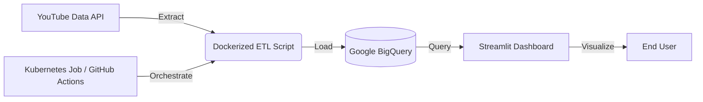

# 📊 YouTube Growth Analytics Pipeline

[](https://youtube-analytics-pipeline-pkecprzlshg35cs2i4vwz5.streamlit.app/)
[](https://github.com/nbx0021/youtube-analytics-pipeline/actions/workflows/daily_run.yml)

## 🚀 Project Overview
This project is a **Containerized Data Engineering Pipeline** that tracks the daily growth (Subscribers & Views) of top tech and entertainment YouTube channels.

It automates the extraction of data using the **YouTube Data API**, stores it in a **Google BigQuery** Data Warehouse, and visualizes the trends in a real-time **Streamlit Dashboard**. The entire workflow is containerized with Docker and can be orchestrated via Kubernetes.

**Goal:** To analyze growth patterns of competitors like MrBeast, T-Series, and Cocomelon without manual data entry.

---

## 🏗️ Architecture
The pipeline supports both Serverless (GitHub Actions) and Cloud-Native (Kubernetes) execution.



## 🛠️ Tech Stack

* **Language:** Python 3.11 (Slim Image)
* **Cloud Data Warehouse:** Google BigQuery
* **Containerization:** Docker & Docker Hub
* **Orchestration:** Kubernetes (K8s Jobs) & GitHub Actions
* **Data Visualization:** Streamlit & Plotly
* **Infrastructure:** Hybrid (Local K8s + Cloud Serverless)

---

## ✨ Key Features

* **🔄 Automated ETL:** Runs daily to fetch fresh subscriber counts and video metrics.
* **🐳 Dockerized:** Fully containerized environment ensuring "write once, run anywhere" reliability.
* **☸️ Kubernetes Ready:** Includes `job.yaml` for orchestration on K8s clusters.
* **🛡️ Secure:** Uses Kubernetes Secrets and `.gitignore` to protect API keys.
* **📈 Interactive UI:** Dashboard features dynamic line charts, growth heatmaps, and ranking battles.

---

## ⚙️ How to Run

### Option 1: Run with Docker (Recommended)

No need to install Python dependencies manually.

```bash
# 1. Build the image
docker build -t youtube-etl .

# 2. Run the container (Mounting secrets safely)
docker run --rm \
  -e YOUTUBE_API_KEY="your_api_key_here" \
  -v $(pwd)/service_key.json:/app/service_key.json \
  youtube-etl

```

### Option 2: Run with Kubernetes

Simulate a production batch job.

```bash
# 1. Upload Secrets to Cluster
kubectl create secret generic gcp-key --from-file=service_key.json
kubectl create secret generic youtube-api --from-literal=api_key="your_api_key"

# 2. Deploy Job
kubectl apply -f job.yaml

```

### Option 3: Run Locally (Legacy Python Method)

```bash
pip install -r requirements.txt
python etl_bigquery.py
streamlit run dashboard.py

```

---

## 🤖 Automation (GitHub Actions)

The ETL script is also configured to run serverless via `.github/workflows/daily_run.yml`:

* **Schedule:** Runs daily at 8:00 AM UTC.
* **Manual Trigger:** Can be executed manually via the "Actions" tab.

---

## 📊 Live Dashboard

Check out the live analytics here: **[Link to Streamlit App](https://youtube-analytics-pipeline-pkecprzlshg35cs2i4vwz5.streamlit.app/)**
