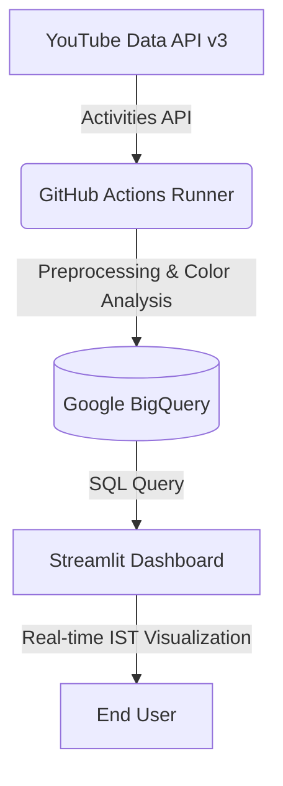

# ⚡ YouTube Velocity Intelligence (v4.0)

[](https://youtube-velocity-tracker.streamlit.app/)
[](https://github.com/nbx0021/youtube-analytics-pipeline/actions/workflows/daily_run.yml)

## 🚀 Project Overview

**YouTube Velocity Intelligence** is a high-frequency data engineering pipeline designed to track real-time performance metrics of top-tier global and Indian YouTube creators.

Unlike standard analytics, this system focuses on **Velocity**—measuring how fast views grow in 3-hour windows—and **Thumbnail Psychology**, analyzing how colors and titles (e.g., ALL CAPS vs. Normal) impact virality.

**Goal:** To provide actionable insights into the competitive landscape across Tech, Finance, AI, and the booming Indian content market.

---

## 🏗️ System Architecture

The pipeline is built for high reliability and zero-cost scaling using a serverless-first approach.



## 🛠️ Tech Stack

* **Language:** Python 3.11
* **Data Warehouse:** Google BigQuery (Fact Table Architecture)
* **Automation:** GitHub Actions (CRON: `35 */3 * * *`)
* **Visuals:** Streamlit, Plotly (Dynamic Line Charts), & NumPy
* **Image Processing:** Pillow (Dominant Color Extraction)
* **Deployment:** Docker & Streamlit Cloud

---

## ✨ Upgraded Features (v4.0)

* **🇮🇳 India Top Gallery:** A dedicated live grid for the Indian market (CarryMinati, Dhruv Rathee, etc.) featuring instant performance metrics.
* **📈 Velocity Tracking:** Line charts with vertical, scrollable legends for "one-by-one" asset comparison.
* **🎨 Color Psychology:** Analyzes thumbnail dominant colors to see if specific hues (Red/Yellow) correlate with higher engagement.
* **📣 Strategy Insights:** Automatically calculates the "CAPS Lift"—the percentage increase in views for videos using ALL CAPS titles.
* **🕒 IST Timezone Sync:** All data snapshots are automatically converted from UTC to Indian Standard Time for accurate local analysis.

---

## ⚙️ Project Structure

```text
youtube-analytics-pipeline/
├── .github/workflows/   # Automation (3-hour sync)
├── config/              # YAML (Verified Channel IDs)
├── dashboard/           # UI Engine (app.py)
├── src/                 # ETL Engine (etl.py, image_utils.py)
├── Dockerfile           # Containerization
└── requirements.txt     # Dependencies

```

---

## 🚀 Setup & Execution

### 1. Environment Configuration

Create a `.env` or set GitHub Secrets for:

* `YOUTUBE_API_KEY`: Google Cloud Console API Key.
* `GCP_SA_KEY`: Service Account JSON (Converted to TOML for Streamlit).

### 2. Local ETL Run

```bash
# Run the pipeline manually
python -m src/etl.py

```

### 3. Dashboard Launch

```bash
streamlit run dashboard/app.py

```

### 4. Docker Deployment

```bash
# Pull the latest version from Docker Hub
docker pull nbx0021/youtube-etl:latest

# Run the container
docker run --rm \
  -e YOUTUBE_API_KEY="your_api_key" \
  -v $(pwd)/service_key.json:/app/service_key.json \
  nbx0021/youtube-etl

```

## 📊 Roadmap

* [x] High-frequency (3-hour) data snapshots.
* [x] Automated India-specific sector tracking.
* [x] Thumbnail color extraction.
* [ ] AI-driven title sentiment analysis."

---

## 👤 Author

**Narendra Bhandari**
