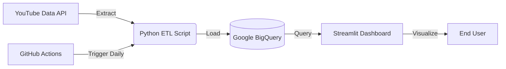

# 📊 YouTube Growth Analytics Pipeline

[](https://youtube-analytics-pipeline-pkecprzlshg35cs2i4vwz5.streamlit.app/)
[](https://github.com/nbx0021/youtube-analytics-pipeline/actions/workflows/daily_run.yml)

## 🚀 Project Overview
This project is a **Serverless Data Engineering Pipeline** that tracks the daily growth (Subscribers & Views) of top tech and entertainment YouTube channels.

It automates the extraction of data using the **YouTube Data API**, stores it in a **Google BigQuery** Data Warehouse, and visualizes the trends in a real-time **Streamlit Dashboard**.

**Goal:** To analyze growth patterns of competitors like MrBeast, T-Series, and Cocomelon without manual data entry.

---

## 🏗️ Architecture
The pipeline is fully automated and runs on the cloud for free ($0 cost).



## 🛠️ Tech Stack

* **Language:** Python 3.9
* **Cloud Data Warehouse:** Google BigQuery
* **Orchestration/Automation:** GitHub Actions (Cron Job)
* **Data Visualization:** Streamlit & Plotly
* **API:** YouTube Data API v3
* **Infrastructure:** Serverless (Cloud-Native)

---

## ✨ Key Features

* **🔄 Automated ETL:** Runs every day at 8:00 AM UTC via GitHub Actions.
* **🛡️ Secure:** Uses GitHub Secrets and Streamlit Secrets to manage API keys securely.
* **⚡ Cost Optimized:** Designed to run entirely within the Google Cloud Free Tier.
* **📈 Interactive UI:** Dashboard features dynamic line charts, growth heatmaps, and ranking battles.

---

## ⚙️ How to Run Locally

### 1. Clone the Repository

```bash
git clone [https://github.com/nbx0021/youtube-analytics-pipeline.git](https://github.com/nbx0021/youtube-analytics-pipeline.git)
cd youtube-analytics-pipeline

```

### 2. Install Dependencies

```bash
pip install -r requirements.txt

```

### 3. Setup Credentials

* **Google Cloud:** Place your `service_key.json` in the root folder.
* **Streamlit Secrets:** Create a `.streamlit/secrets.toml` file:
```toml
[gcp_service_account]
type = "service_account"
project_id = "your-project-id"
private_key = "..."
...

```


### 4. Run the Dashboard

```bash
streamlit run dashboard.py

```

---

## 🤖 Automation (GitHub Actions)

The ETL script (`etl_bigquery.py`) is triggered automatically by the workflow defined in `.github/workflows/daily_run.yml`.

* **Schedule:** Runs daily.
* **Manual Trigger:** Can be executed manually via the "Actions" tab for testing.

---

## 📊 Live Dashboard

Check out the live analytics here: **[Link to your Streamlit App](https://youtube-analytics-pipeline-pkecprzlshg35cs2i4vwz5.streamlit.app/)**


